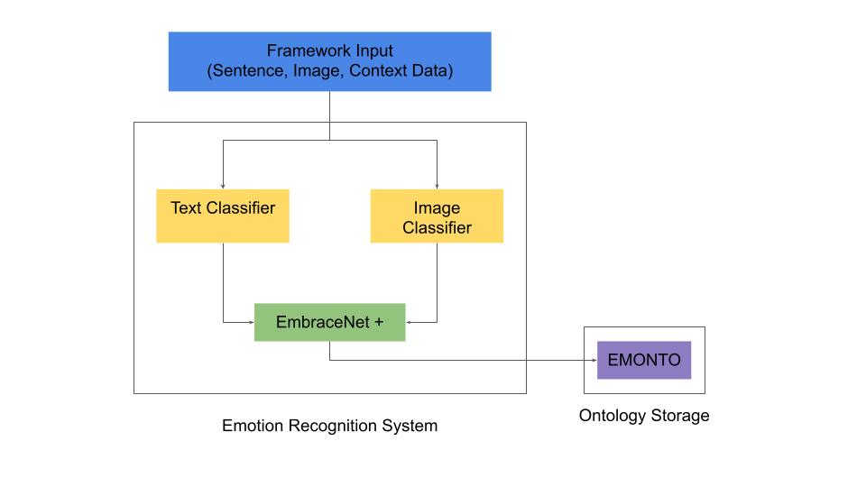
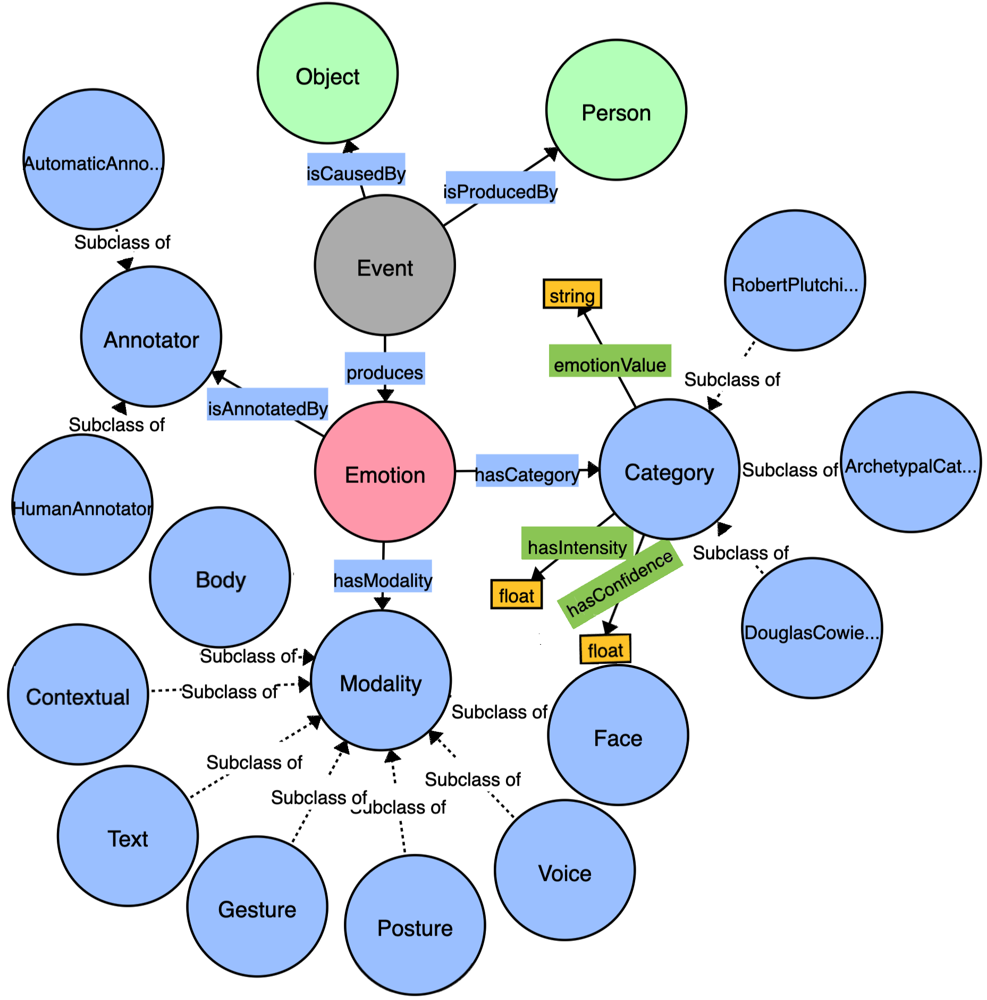

# SentiLib

Python Library for emotion detection in text and images using multimodal function.

This library is an implementation of SENTI-Framework. It's structure and functionality overviews are as follows:



This library enables emotion recognition recognition in [text](https://www.mdpi.com/1424-8220/21/4/1322) and [images](https://github.com/juan1t0/multimodalDLforER) using deep learning models. It also enables multimodal analysis using [EmbraceNet+](https://www.researchgate.net/publication/353397619_A_Multi-modal_Visual_Emotion_Recognition_Method_to_Instantiate_an_Ontology) merging both modalities.

After executing the required emotion recognition, the emotion, information regarding the person presenting it and the event can be stored in an ontology for further analysis. Fot this we provide [Emonto](https://www.researchgate.net/publication/353397619_A_Multi-modal_Visual_Emotion_Recognition_Method_to_Instantiate_an_Ontology), an extensible emotion ontology whose structure is shown in the next image.



## Usage

In order to use this project: 

- Set the root of this project as the working directory.
- Download the ```YOLO-weights``` and ```checkpoints``` folders available [here](https://drive.google.com/drive/folders/1s_K-ioCcQ7n8Ob-m4h-mz0-bMGtrRurN?usp=sharing) and add them to the ```SentiLib/image_utils``` directory. 
- If you wish to use your own pretrained models for this library, add or replace the models in the ```SentiLib/assets``` directory (we are working on enabling users to do their own pretraining for the models using our arqchitectures).
- Install the library with ```pip install .```

An interactive example on how to use this library available [here](https://colab.research.google.com/drive/1ARAdw5cyJo4UdPw0Kt6LzdKGPDcuGr-V?usp=sharing).

## Citation
<!-- If you use our code or models in your research, please cite with:
```

``` -->
Upon publication we will add our work reference here.

## Acknowledgments
This research was supported by the FONDO NACIONAL DEDESARROLLO CIENTÍFICO, TECNOLÓGICO Y DE INNOVACIÓN TECNOLÓGICA - FONDECYT as executing entity of CONCYTEC under grant agreement no.01-2019-FONDECYT-BM-INC.INV in the project RUTAS: Robots for Urban Tourism,Autonomous and Semantic web based.
